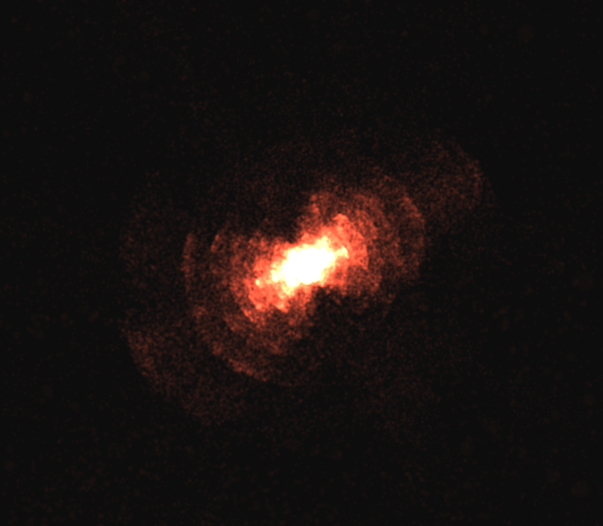

# Real-Time CUDA Accelerated Barnes-Hut N-Body Simulation

A tree code implementation for the Barnes-Hut algorithm, running in real-time on the GPU, developed using CUDA C++ and OpenGL, which scales to systems of few million particles on a NVIDIA RTX 500 Ada Laptop GPU.


## Prerequisites

The program was developed and tested on Ubuntu 22.04 LTS using the CUDA Toolkit 12.9, SDL2 and OpenGL 4.3 core.
The basic dependencies can be installed under Ubuntu by running
```
sudo apt install build-essential libsdl2-dev libglew-dev
```

Detailed installation instructions for the CUDA Toolkit can be found .

## Building

To build the project, run
```
make
```
Build files will be placed under `build/`, running
```
make clean
```
will remove the `build/` directory but keep the executable.

## Usage

The program can be executed by running
```
./main
```

Drag to orbit the camera around the origin, and scroll to zoom. Pressing `o` key toggles the octree visualization, `space` pauses/resumes the simulation.

## Gallery

|  |   |
|:--------:|:-------:|
| Basic visualization | Octree visualization |

|  |   |
|:--------:|:-------:|
| Self-gravitating disk of 262k particles | Cold collapse of uniform sphere |

|  |   |
|:--------:|:-------:|
| Disk of 524k particles running at ~37 FPS (θ=0.75) | Two disks of 262k particles each running at ~30 FPS (θ=0.75) |

### 2,097,152 particles at ~150ms per step (θ=0.6)


<iframe src="https://drive.google.com/file/d/1xW9Tdw1l5E27tiwxv8tOEpSVtm1SDOSY/preview" width="640" height="480" allow="autoplay"></iframe>

## Bibliography

- Tero Karras. 2012. Maximizing parallelism in the construction of BVHs, octrees, and k-d trees. In Proceedings of the Fourth ACM SIGGRAPH / Eurographics conference on High-Performance Graphics (EGGH-HPG'12). Eurographics Association, Goslar, DEU, 33–37.

- Robin Cazalbou, Florent Duchaine, Eric Quémerais, Bastien Andrieu, Gabriel Staffelbach, and Bruno Maugars. 2024. Hybrid Multi-GPU Distributed Octrees Construction for Massively Parallel Code Coupling Applications. In Proceedings of the Platform for Advanced Scientific Computing Conference (PASC '24). Association for Computing Machinery, New York, NY, USA, Article 14, 1–11. https://doi.org/10.1145/3659914.3659928

- Jeroen Bédorf, Evghenii Gaburov, and Simon Portegies Zwart. 2012. A sparse octree gravitational N-body code that runs entirely on the GPU processor. Journal of Computational Physics 231, 7 (2012), 2825–2839. DOI:https://doi.org/https://doi.org/10.1016/j.jcp.2011.12.024


## TODO

- fit octree to bbox
- revert to 32 sized groups when traversing (apparently faster)
- quadruple moments
- switch to trailing underscore for private members, remove leading underscore for private methods
- traversal queue allocation
- plummer for accuracy

## Future work

- replace cub and thrust primitives with custom kernels
- power spectrum ic
- janus cosmological model


