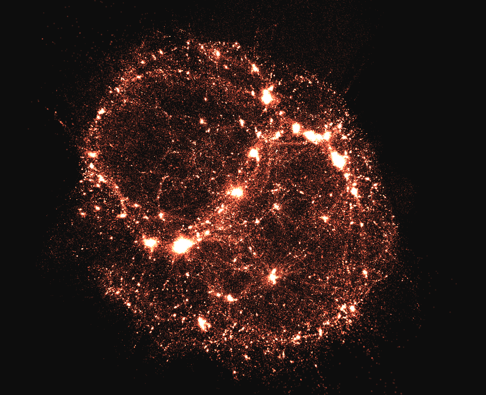
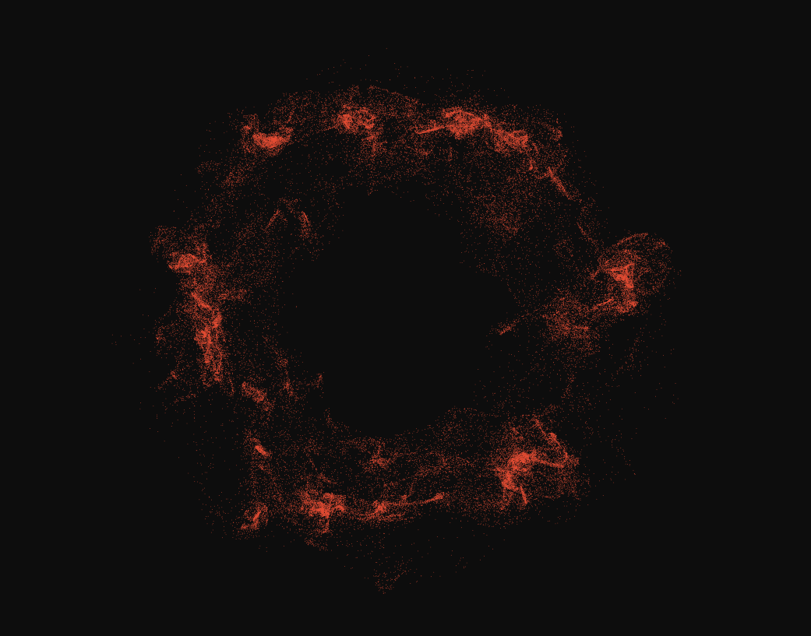
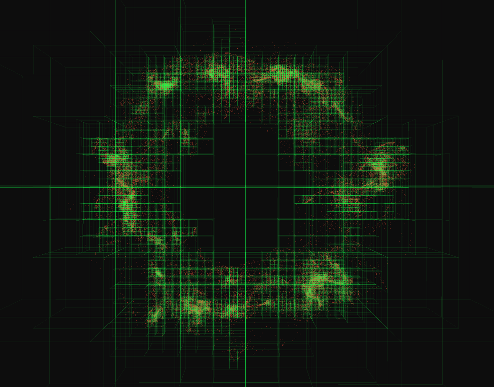
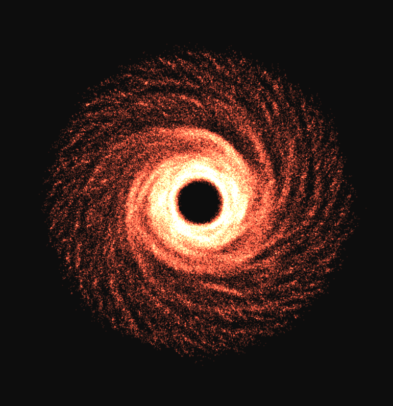

# Real-Time CUDA Accelerated Barnes-Hut N-Body Simulation

A tree code implementation for the Barnes-Hut algorithm, running in real-time on the GPU, developed using CUDA C++ and OpenGL, which scales to systems of few million particles on a NVIDIA RTX 500 Ada Laptop GPU.



## Prerequisites

The program was developed and tested on Ubuntu 22.04 LTS using the CUDA Toolkit 12.9, SDL2 and OpenGL 4.3 core.
The basic dependencies can be installed under Ubuntu by running
```
sudo apt install build-essential libsdl2-dev libglew-dev
```

Detailed installation instructions for the CUDA Toolkit can be found .

## Building

To build the project, run
```
make
```
Build files will be placed under `build/`, running
```
make clean
```
will remove the `build/` directory but keep the executable.

## Usage

The program can be executed by running
```
./main
```

Drag to orbit the camera around the origin, and scroll to zoom. Pressing `o` key toggles the octree visualization, `space` pauses/resumes the simulation.

## Gallery

|  |   |
|:--------:|:-------:|
| Basic visualization | Octree visualization |

#### Self-gravitating disk of 262k bodies 



#### Two self-gravitating disks of 262k bodies


## TODO

- fit octree to bbox
- revert to 32 sized groups when traversing (apparently faster)
- quadruple moments
- switch to trailing underscore for private members, remove leading underscore for private methods
- traversal queue allocation
- plummer for accuracy

## Future work

- replace cub and thrust primitives with custom kernels
- power spectrum ic
- janus cosmological model


